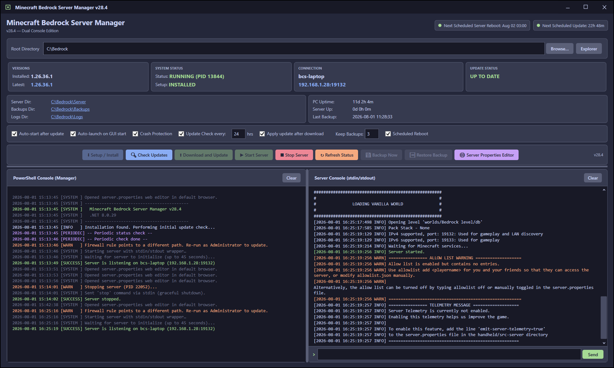
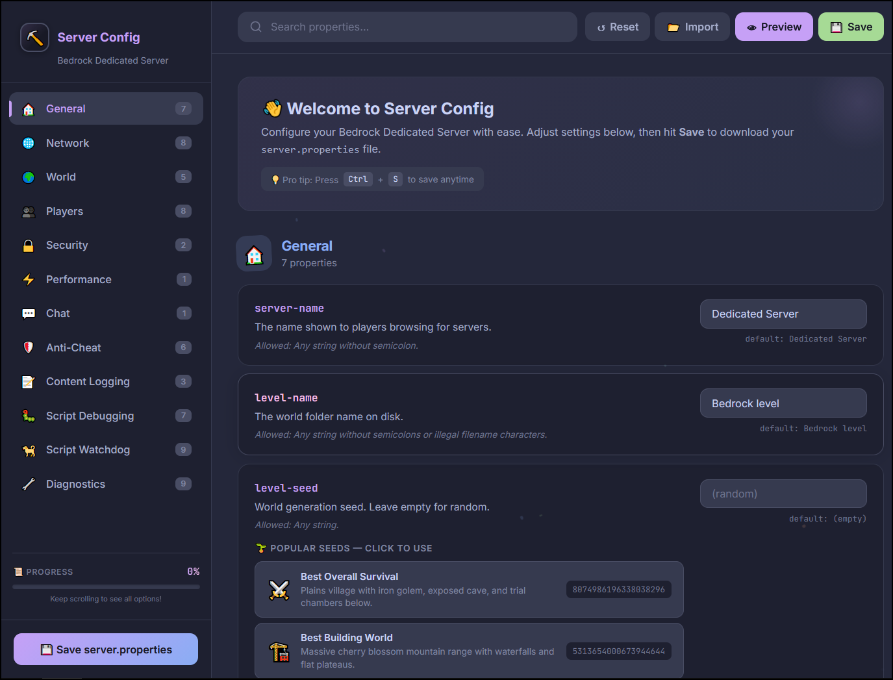

# Minecraft Bedrock Server Manager (C# / WPF Edition)

A modern, feature-rich desktop application built with .NET 8 and WPF designed to automate the management of the Minecraft Bedrock Dedicated Server on Windows. It wraps the server process, providing a beautiful graphical interface, dual console layout, automated updates, backups, and crash recovery—optimized for long-term stability (weeks or months of uptime).

<table>
  <tr>
    <td align="center">
      
    </td>
    <td align="center">
      
    </td>
  </tr>
</table>

## 🌟 Features

### Dual Console Layout
- **Manager Console (Left):** Displays manager-side logs, update statuses, and system events.
- **Server Console (Right):** Live capture of `bedrock_server.exe` stdin/stdout. You can type commands directly into the GUI to send them to the server (e.g., `say hello`, `list`, `stop`).

### Automated Server Management
- **First-Time Setup:** Automatically downloads the latest Bedrock Server zip from the official Minecraft API, extracts it, and configures the directories.
- **Auto-Updates:** Periodically checks for new server versions. Can automatically download, backup, and apply updates without manual intervention.
- **Crash Protection:** Monitors the server process. If the server crashes unexpectedly, the manager waits 10 seconds (to prevent file locks) and automatically restarts it.

### Backup & Restore
- **Full Backups:** Compresses server configurations (`server.properties`, `allowlist.json`, `permissions.json`) and world files into a single `.zip` archive.
- **SHA256 Verification:** Generates a manifest of file hashes during backup. Upon restoration, it verifies every file's checksum to ensure zero corruption before applying the files.
- **Retention Policy:** Automatically purges old backups to retain only a specified number of recent archives.

### Scheduling & Maintenance
- **Scheduled Reboots:** Configurable restarts (Daily, Weekly, Biweekly, Monthly) to keep server performance high and clear memory leaks.
- **Uptime Tracking:** Monitors and displays both PC uptime and Server uptime directly on the dashboard.

### Network & System Configuration
- **Firewall Automation:** Automatically creates and manages Windows Firewall rules for the server executable using `netsh`.
- **Dependency Checks:** Checks for Administrator privileges and prompts the user to install the Visual C++ Redistributable if it's missing.

### User Experience
- **Single-File Portable EXE:** Compiled into a single self-contained executable. No need to install the .NET runtime; just download and run.
- **Custom Dark Theme:** Features a sleek, custom-built Catppuccin Macchiato dark theme with custom-styled scrollbars, title bar, and controls.
- **Instant Save:** All settings (root paths, update intervals, backup limits) are saved instantly to a configuration file whenever modified.

## 🎯 Who is this for?

- **Casual Hosts:** Players who want to run a dedicated Bedrock server for their friends on their personal Windows PC but don't want to deal with command-line windows staying open on their taskbar.
- **Community Admins:** Server operators who need a reliable way to automate updates, perform safe backups, and monitor server logs without RDPing into a terminal.
- **Automation Enthusiasts:** Users who want crash recovery and scheduled reboots to ensure maximum server uptime without manual oversight.

## 🚀 Why should you use it?

1. **Zero Downtime Worry:** The built-in crash detection and scheduled reboot system ensure your server stays healthy over long periods.
2. **Safe Updates:** Updating a live server is risky. This manager safely stops the server, performs a verified backup, extracts the new files, and restarts automatically.
3. **No Command Line Required:** The dual-console layout gives you the power of the raw server console right inside a modern Windows GUI.
4. **Portable & Clean:** It compiles down to a single `.exe` file. It doesn't clutter your system with installers or require external runtimes.
5. **Resource Efficient:** Built natively with C# and WPF, it runs smoothly in the background without consuming excessive CPU or RAM.

## 📦 Installation & Usage

1. Download the latest `BedrockServerManager.exe` from the Releases page.
2. Right-click the executable and select **Run as Administrator** (recommended for firewall and network configuration).
3. Set your Root Directory (e.g., `C:\Bedrock`).
4. Click **Setup / Install** to download the latest server files.
5. Use the dashboard to start, stop, backup, and configure your server.

If you want your friends to be able to quickly be able to connect, run this command in the bottom right.

`allowlist off`

That means anyone can join. It's convienent, but insecure. 

If the server is public-facing, you should disable this setting for security reasons.

Instead of running that `allowlist off` command, manually manage the allowlist using allowlist.json.

# Developer Notes
How to create a self contained executable

Clean and Publish

In Visual Studio, go to Build -> Clean Solution.
Open the Terminal (View -> Terminal).
Run this simple command:
     
`dotnet publish -c Release`

Find your Single EXE

When the command finishes, look in this exact folder:

\bin\Release\net8.0-windows\win-x64\publish\

Inside that publish folder, you will find only one file: BedrockServerManager.exe. You can copy that single .exe to any Windows computer and run it directly without installing anything!
